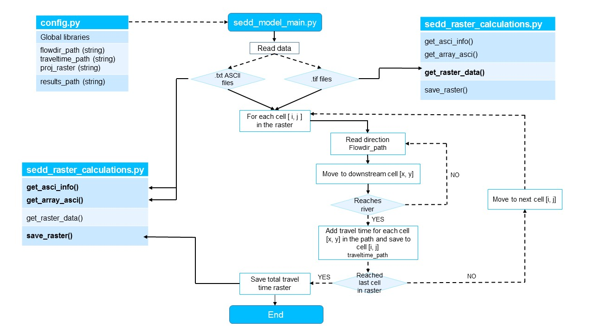

# Sum Up Pixel Values Along a Flow Path for SEDD

# Introduction
The algorithms provided with this repository sum up pixel values of an input raster along a (flow) path in upstream direction. The (flow) direction is determined based on a flow direction *GeoTIFF* raster. The primary development goal of the algorithms were to calculate the travel time of eroded particles of a river network or catchment outlet based on a pixel-specific travel time according to [Jain and Kothyari (2000)](https://www.tandfonline.com/doi/pdf/10.1080/02626660009492376?needAccess=true). This technique works semantically with any eight-directional flow model (D8). Here, the flow direction is defined according to [Jenson & Domingue 1998](https://pro.arcgis.com/en/pro-app/latest/tool-reference/spatial-analyst/how-flow-direction-works.htm), which is typically also used in GIS programs, such as [QGIS](https://qgis.org).

## Requirements

The algorithms are written in Python3 ([get installation instructions](https://hydro-informatics.com/python-basics/pyinstall.html)) and build on the following external libraries:  *gdal*, *numpy*, *pandas*

In addition, the following standard Python libraries are used: *glob*, *os*, *sys*, *time*

## Input

The below-listed input arguments and data have to be provided to run the algorithms. The input arguments are variables that can be set in `ROOT/config.py`.

| Input argument | Type | Description |
|----------------|------|-------------|
|`flowdir_path`| *string* | path for the flow direction raster (D8) (in .txt ASCII file format or raster format)|
|`traveltime_path`| *string* | path for the raster to be summed up along the flow path (here travel time) (in .txt ASCII file format or raster format)  |
|`proj_raster`| *string* | path for the projection raster (program gets the raster projection, in case both input rasters are in .txt format) (.tif format)  |
|`results_path`| *string* | Path of the result folder |

## Output

**Result folder:** `TotalTravelTime.tif` raster file (.tif) which contains the travel time of the eroded particles to the river network as pixel values.

## Code Diagram

## Authors
- Kilian Mouris
- Maria Fernanda Morales Oreamuno
- Sebastian Schwindt
